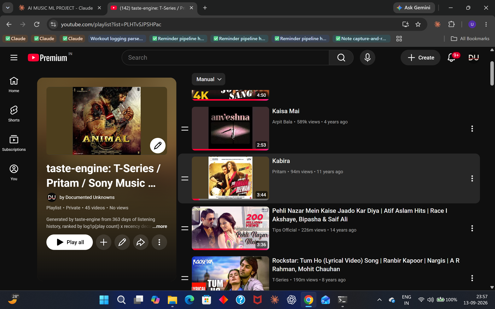

# taste-engine

A personal music recommendation and playlist-generation system built over one year of
my own YouTube listening history. It parses a Google Takeout export (40,619 plays,
2,918 canonical tracks, 362 days), resolves and classifies each video through the
YouTube Data API, scores tracks by play count and recency, clusters them by embedding
similarity, and writes the resulting playlists back to my real YouTube account.

On the rediscovery task — surfacing tracks I'd stopped playing, excluding my global
top 50 — it scores nDCG@20 of 0.3312 against a 0.1382 baseline, a 139.7% improvement
that held in all three held-out splits. **At n=3 that is p=0.125 and not statistically
certifiable.** The direction has survived six successive corrections to the pipeline;
the magnitude has moved every single time.

That second paragraph is the point of this repository. The interesting artifact here is
not the number — it's the record of how many times the number was wrong, how it was
caught, and what was measured to close each question. Five separate directions were
investigated and killed by measurement rather than abandoned quietly. They're documented
below with the same weight as the result.



*The playlist `taste-engine write` actually wrote: 45 tracks from the
"T-Series / Pritam / Sony Music India" cluster, produced by `--mode
rediscover` and confirmed against the live API (§8).*

## What was measured and rejected

Each of these was a promising direction. Each got a written brief, a measurement, and a
report that is still in this repository. None of them worked.

**Genre-based backfill (`reports/genre_coverage.md`).** YouTube's `topicCategories`
labels are too coarse to constrain anything: "pop" covers 2,176 of 2,918 tracks, roughly
75% of the library. A genre guard built on them is near-vacuous for exactly the clusters
that needed it. Once non-discriminative labels are excluded, only 3 of 37 clusters have
a usable genre signal.

**Last.fm community tags (`reports/lastfm_coverage.md`).** Proposed as a finer-grained
replacement. Track-level tag coverage came back at 640 of 2,918 (21.9%), far below what
a per-track signal needs to be usable. Kept in the repo as a documented negative
result. The artist-level fallback was rejected separately, because it would have
reintroduced the artist-shapedness the whole exercise was meant to escape.

**Cluster shape (`reports/listening_test.md`).** Hypothesis: single-artist clusters
surface fewer genuinely forgotten tracks than mixed ones. Two playlists were written
live to my account and marked track by track. The single-artist cluster scored 7 of 11
forgotten; the genuinely mixed cluster scored 3 of 13. The hypothesis was refuted by its
own test, and with it the whole direction it implied — making clusters less
artist-shaped would not have fixed what it was aimed at. A third arm was written and
never marked; the report says so.

**Dormancy signals (`reports/dormancy_probe.md`).** Hypothesis: rank by how long a track
has been unplayed. The Takeout export spans 362 days and 61.8% of the library has exactly
one lifetime play, so "days since last play" mostly measures when a track first appeared,
not when it was abandoned. The signal doesn't exist in this data.

**Backfill as a feature.** The cumulative result of the above: `BACKFILL_ENABLED` is
`False`. The FLOOR / LENGTH / GUARD / RANK / CEILING machinery is still in the codebase,
tested and unreached, because the architecture is sound and the input signals are not.
Playlists ship native-only and return short rather than padding.

### Quickstart

1. Export your data from [Google Takeout](https://takeout.google.com)
   (YouTube and YouTube Music → history + playlists) and unzip it under
   `data/raw/`.
2. Get a YouTube Data API key (`YT_API_KEY`); for write-back only, download an
   OAuth client as `credentials.json` (exact steps: §10).
3. `bash scripts/setup_env.sh && bash scripts/install_pkg.sh` — venv + editable install.
4. `python -m taste_engine.parse_takeout` — Takeout → SQLite, ~15s, offline.
5. `python -m taste_engine.resolve && python -m taste_engine.classify` — resolve video metadata, then classify music vs. not.
6. `taste-engine write --cluster-name "..."` — dry run; nothing is written
   without `--commit`. Playlist length is computed from cluster depth, not
   requested — `--limit` applies only to a non-cluster write.

Every command, every flag, and what each one costs: §10.

---

## 1. How the number was wrong three times

| | reported | why it was wrong |
|---|---:|---|
| first | **+28.7%**, 4/4 splits | the hold-out set itself varied with the half-life |
| second | **+7.8%**, 3/4 splits | half-life tuned on the same splits it was reported on |
| third | **+1.9%**, 2/3 splits | honest tuning — but measured on duplicate-inflated tracks |
| **fourth** | **+140%**, 3/3 splits | duplicates collapsed, non-music filtered; **not certifiable at n=3** |

Two of those corrections made the number smaller. The third made it much
bigger, because the bias was in the *baseline's* favour. Neither direction was
chosen; both fell out of a check.

### 1.1 The leak, and the control that caught it

`evaluate.py` carried this comment, written when the sweep was added, on the
assumption it would never matter:

> `most_played` is invariant to half-life, so its column is a control — if it
> moves, something is leaking.

It moved: baseline nDCG drifted **0.270 → 0.339** across a half-life sweep, and
a baseline cannot depend on a parameter it does not use.

`scored_tracks()` returns rows ordered by `score`. The rediscovery task holds
out the 50 most-played tracks, and where play counts *tie* at that cutoff,
`head(50)` silently inherited the incoming order — so the half-life decided
which tracks were held out. The excluded set was a function of the model being
evaluated.

One clause fixes it (`sort_values(["play_count", "video_id"])`). Four tests
stop it returning:

```python
def test_baseline_score_is_independent_of_half_life(self, db):
    scores = {evaluate_rediscovery(db, SPLIT, half_life=hl, ...)["results"]
              .iloc[0]["ndcg@20"] for hl in (7, 30, 90, 365)}
    assert len(scores) == 1, f"baseline nDCG moved with half-life: {scores}"
```

The +28.7% had already been written into this README and committed. It was
withdrawn rather than quietly edited.

### 1.2 Selection bias, and nested tuning

With the leak closed the lift was +7.8% — but the half-life had been chosen by
sweeping the same four splits the result was reported on, making it an upper
bound rather than an estimate.

Nested protocol (`scripts/nested_eval.py`): select the half-life on the
**earlier** splits, report on the **later** ones the selection never touched.
The gap is stark — on canonical tracks, the chosen setting scores **+22.1% on
the dev splits** and the held-out splits are what the README reports.

### 1.3 Duplicate uploads, and why they break implicit feedback

This is the correction worth reading, because it is invisible until you look
for it and it biases the result in the direction that flatters the baseline.

YouTube carries the same recording many times: the label's official video, the
auto-generated `- Topic` audio, a lyric video, an extended cut. Each is a
distinct `videoId`. To everything upstream they are distinct tracks.

That breaks implicit-feedback evaluation in two ways at once:

**It inflates nDCG.** Three uploads of one song that the user replays count as
three separate hits. A model that surfaces one song three times scores like a
model that surfaced three songs.

**It leaks the hold-out.** The rediscovery task removes the 50 most-played
tracks precisely so the model cannot win by naming favourites. But a song whose
plays are *split* across four uploads may sit below the cutoff on every one of
them. Measured directly — of the 50 genuinely most-played songs, how many had
at least one upload survive into the candidate pool?

| split | true top-50 songs | leaked into raw pool | leaked after collapsing |
|---|---:|---:|---:|
| 2026-04-01 | 50 | 35 | 0 |
| 2026-05-01 | 50 | 34 | 0 |
| 2026-06-01 | 50 | 34 | 0 |
| 2026-07-01 | 50 | 36 | 0 |
| 2026-08-01 | 50 | 37 | 0 |

**70% of the user's favourites were surviving a hold-out built to exclude
them.** The "rediscovery" task was substantially not measuring rediscovery, and
the beneficiary was the most-played baseline — which is why its nDCG falls from
0.29–0.46 to 0.11–0.17 once the duplicates are merged.

`canonical.py` collapses packaging variants of one recording and sums their
plays: **3,570 tracks → 3,143 songs** (427 collapsed, 12%; 359 songs had more
than one upload, the largest five).

**The first implementation of this was itself wrong**, and the guard that
caught it was a report of merges spanning different artists. Keying on
normalised title alone fused *Die For You* by Joji with *Die For You* by The
Weeknd, *Falling* by Harry Styles with *Falling* by Trevor Daniel, and 102
other distinct-song pairs. The failure modes are not symmetric — an over-merge
sums the play counts of different songs and puts the wrong track in a playlist,
while an under-merge leaves a duplicate, which is the problem already present —
so the artist is part of the key and the merge is deliberately conservative.
Remixes, covers, live and instrumental versions keep their own identity.

Residual cost, stated rather than hidden: an upload credited to a featured
artist's channel does not merge with the same song on the lead artist's. The 7
remaining cross-artist groups are case variants of one name (`AFUSIC`/`Afusic`).

### 1.4 Why only five splits

Nine monthly boundaries fit in 363 days; four are unusable, for a reason that
is a property of the data rather than a threshold anyone picked. (Counts below
were measured before the non-music filter of §1.5; the ramp is what matters and
it is unchanged.)

| split | train days | music tracks in train | reachable test truth |
|---|---:|---:|---:|
| 2025-12-01 | 78 | 166 | 0 |
| 2026-01-01 | 109 | 190 | 4 |
| 2026-02-01 | 140 | 227 | **0** |
| 2026-03-01 | 168 | 227 | 15 |
| **2026-04-01** | 199 | **1,139** | 325 |
| 2026-05-01 | 229 | 1,707 | 406 |
| 2026-06-01 | 260 | 2,460 | 458 |
| 2026-07-01 | 290 | 2,929 | 296 |
| 2026-08-01 | 321 | 3,138 | 496 |

Music tracks jump **227 → 1,139** between March and April — the account's music
listening effectively begins in March 2026, the same weeks as the playlist bulk
import in §4. The 363-day figure describes the **watch** history; the usable
**music** history is about six months.

Two of the five splits are spent selecting the half-life, leaving three to
report on. **That is what caps this result**, see below.

### 1.5 Non-music in the training set, and which signal admits it

§5 defends `is_music` as the union of heuristics and `categoryId`. That claim
only stands if the union is not admitting substantial non-music, so it was
measured rather than asserted (`scripts/contamination.py`).

**5.6% upper bound** — 176 of 3,143 songs flagged by `categoryId`, by a
non-song title, or by a runtime under 45 s or over 15 minutes.

The permissive signal is the surprising one. Of the 127 songs flagged by title
or duration, here is what admitted each *alone*:

| signal | admitted alone |
|---|---:|
| Channel ends with `- Topic` | 0 |
| Channel contains `VEVO` | 0 |
| Played on `music.youtube.com` | 1 |
| Video appears in a playlist | 5 |
| Video in YT Music library | 0 |
| **`categoryId == 10` alone** | **121** |

**`categoryId` is the contaminating signal, not the heuristics** — guitar
tutorials, film promos and a 63-minute vlog, all uploaded by channels YouTube
files under category 10. So §5's "far stronger label" needs splitting in two:
stronger on **recall** (it found the 712 artist-channel songs the heuristics
miss), weaker on **precision** (it admits non-songs the heuristics never
would). Both are true and the README previously said only the first.

`STRICT_MUSIC` (on by default) drops songs admitted by categoryId *alone* that
do not look like songs. It removes 202 songs carrying 220 plays — a mean of
**1.1 plays each**.

**The headline does not move, and that null was verified rather than assumed.**
Identical numbers are equally consistent with "the filter never reached the
evaluated set", so `scripts/verify_strict_null.py` checks which story is true:

| check | result |
|---|---|
| filter removes songs | 202 (6.4%) |
| evaluated pool shrinks per split | −123 / −136 / −163 — **3/3** |
| best rank a removed song reaches | **209** of ~2,000; zero in any top-20 |

The contamination is real and sits far below top-k, so it never enters a
20-item recommendation. That is a finding about where the noise lives, not an
absence of noise.

### 1.6 The duration pass, and its measured false-merge rate

The artist-keyed rule under-merges systematically. Indian labels upload under
the label's own channel with cast metadata in the title, while the
auto-generated `- Topic` twin sits under the composer — so the two never share
an artist and never merge. Runtime settles it: `contentDetails.duration` is
already fetched, and two different songs called "Raabta" do not agree to the
second.

Merging when normalised titles match and runtimes agree within **3 s** finds
**14 further merges**. It works exactly as intended on the case that motivated
it:

| | runtime | channel | outcome |
|---|---|---|---|
| Raabta | 4:04 | Arijit Singh – Topic | merged |
| Raabta | 4:04 | Pritam – Topic | merged (singer vs composer credit) |
| Raabta | 4:46 | Jokhay – Topic | **separate** |

**The measured false-merge rate is 2 of 14 (14%).** Both are title collisions
runtime cannot resolve: Imagine Dragons' *Demons* (2:58) with Joji's (2:57),
and Lil Uzi Vert's *FLEX UP* (2:48) with Lil Yachty's (2:51). Dropping the
tolerance to 0 s would exclude both but would also lose six of the twelve good
merges, so 3 s is kept and the error rate is reported rather than hidden.

**A genre tiebreaker was tried and is inert.** `topicCategories` refuses a
merge when both sides carry genre labels and those labels are disjoint. On this
library it fires **zero** times: there are 35 genre tags and `pop` and
`hip hop` sit on almost everything, so *Demons* overlaps on `pop` and *FLEX UP*
on `hip hop`. It is kept because it costs no good merge and would catch a
genuinely disjoint pair — `Raabta`/Jokhay *is* disjoint — but it did not fix
the two errors above and is not claimed to.

The pass also exposed a bug in the title normaliser: a bare `with` was being
treated as a featured-artist marker, so **"Stay With Me" normalised to "stay"**
and matched The Kid LAROI's "STAY", both 2:22. Bracketed `(with Drake)` was
already handled earlier, so the rule was only ever eating ordinary English.

**Label titles: fixed in normalisation, and the first attempt was wrong.**
Indian label uploads bury the song name in cast metadata —
`Lyrical: Chammak Challo | Ra One | ShahRukh Khan | Kareena Kapoor` against a
bare `Chammak Challo` — so the two never produced the same normalised title and
the duration pass never compared them. Splitting on `|` and stripping publisher
prefixes (`Lyrical:`, `Full Video:`) and a trailing `Song` suffix fixes that.

Keeping the **longest** segment was the obvious rule and is wrong on this
corpus: a cast or composer credit is frequently longer than the song name, and
it fused `Pink Lips` with `BABY DOLL` — two different songs whose longest
segment was the same composer credit. These uploads put the song name first, so
the **first** segment is used, falling back to the longest only when the first
is a single word. The trailing-`Song` strip only fires when two words survive,
so `Love Song` and `Sad Song` are untouched.

**What it still does not fix.** Duration is the wrong discriminator for a label
"Full Video" against its `- Topic` twin, because the video genuinely is longer:
`Chammak Challo` is 4:06 on T-Series and 3:48 on Topic — an 18-second spread
against a 3-second tolerance. Aligning the titles lets the two be *compared*;
it does not make them merge. Raising the tolerance to cover 18 seconds would
create false merges everywhere else, so these pairs remain split and are
counted as such.

### 1.7 What has been stable, and what has not

Six measurements of the same quantity, each after fixing a defect found by the
harness rather than by inspection:

| # | rediscovery lift | what changed |
|---|---:|---|
| 1 | +28.7% | — (hold-out set varied with the half-life) |
| 2 | +7.8% | tie-break made deterministic |
| 3 | +1.9% | nested tuning: select on dev splits, report on held-out |
| 4 | +121% | duplicate uploads collapsed |
| 5 | +128% | non-music filtered, duration-merge pass |
| 6 | **+139.7%** | feature-clause and label-title normalisation fixed |

**The sign has never moved. The magnitude has moved every time.**

The sixth measurement shows the mechanism plainly. Fixing the feature-clause
bug merged `Double Fantasy` and `FRANCHISE` with their `- Topic` twins — both
heavy rotation. With their plays summed they cross into the top-50 favourites
and are *excluded* from the rediscovery pool, which strips strong material from
the **baseline**. The model's score barely moved (0.3343 → 0.3312); the
baseline fell (0.1466 → 0.1382), and the lift rose from +128% to +139.7%
because of it. The same leak §1.3 describes, one layer further down.

In all six measurements the model beats the most-played baseline on
rediscovery. In none of them is the margin stable: it has ranged from +1.9% to
over +120% depending on defects in the *measurement*, not changes to the
*model*. The scoring function has not changed since the first version.

That is the honest summary of this repo. A reader should take the direction
seriously and the magnitude lightly — and should note that the sample size
cannot certify either (§2). What the sequence demonstrates is not a good
recommender; it is a harness that kept finding its own errors, five times,
including twice after a number had already been written down and committed.

**A seventh failure, and why it isn't row 7.** The first live `--commit`
(2026-09-13) never touched the rediscovery number, so it does not belong in
the table above — but it belongs in this sequence. `playlistItems.insert`
returned `HttpError 409 SERVICE_UNAVAILABLE` on the second track of the first
playlist, and the code raised it as an unhandled traceback: the 289-test
suite passed because every mock in it, `tests/fake_youtube.py` included, only
ever simulated the one failure anyone had predicted, `403 quotaExceeded`.
Three partial playlists landed on the real account before anyone looked. The
six rows above were all caught by the harness before they shipped. This one
was not — it was caught by the YouTube API, in production, after the fact.
§8 has the fix, the numbers, and the write that validated it for real. The
point worth keeping here is the shape of the miss: every defect above came
from testing an assumption someone had thought to state. This one came from
an assumption nobody stated, because nobody had reason to doubt it — quota
errors were handled, so "errors are handled" felt covered. It wasn't.

## 2. The result, and what it does not support

### Rediscovery — the task worth measuring

Remove the training window's 50 most-played songs from both the candidate pool
and the ground truth, then ask what else gets played. "Name the tracks he plays
most" *is* the baseline; a model that agrees with it has recommended nothing.

Nested: half-life chosen on 2026-04 and 2026-05, reported on three later splits
the selection never saw.

| split | baseline nDCG@20 | score nDCG@20 | lift | win |
|---|---:|---:|---:|:--:|
| 2026-06-01 | 0.135 | 0.223 | +64% | ✔ |
| 2026-07-01 | 0.107 | 0.392 | +265% | ✔ |
| 2026-08-01 | 0.172 | 0.379 | +121% | ✔ |
| **mean** | **0.138** | **0.331** | **+140%** | **3/3** |

**And it is not statistically established.** With three held-out splits, a
sign test's *best possible* p-value — a clean sweep, which this is — is
**0.125**. No result at this sample size can reach p < 0.05; five held-out
splits would be the minimum. The effect is large and consistent; the evidence
is thin, and those are different claims.

The honest summary: *a +121% lift winning every held-out split, which this
dataset is too small to certify.* Not "a 121% improvement", and not "no
improvement".

`recall@20` is capped at ~4.4% by construction — 20 picks against 296–496
reachable songs — so it compares strategies and is never a headline.

### Replay — the trivial task, kept as contrast

Rank the catalogue by what gets played next, favourites included. Run as first
specified — precision@20 over the remaining 105 days — **every strategy scores
1.00**; a track played 50 times in nine months is certain to recur in the next
three. On the graded version of that window the baseline *wins*.

Bounded to `[2026-06-01, 2026-07-01)` at k=50, on canonical songs — pinned to
an absolute window end (`--test-end`) rather than a relative day count, so the
boundary no longer depends on when the command runs:

```bash
bash scripts/run.sh -m taste_engine.evaluate --split 2026-06-01 --test-end 2026-07-01 -k 50 --half-life 14
```

| strategy | nDCG@50 | Spearman |
|---|---:|---:|
| **score** | **0.551** | 0.358 |
| most_played *(baseline)* | 0.542 | **0.430** |

A +1.6% edge on the task where naming the favourites is nearly optimal — which
is exactly why it is not the headline.

Measured on a dataset snapshot dated 2026-09-15: 2,066 training tracks (5,465
plays) and 867 test tracks (1,613 plays) inside that window — window-scoped
counts, not the whole-catalogue canonical-song count in §3. The bounds above
are now fixed; the rows inside them are not. This is the command that
produced these figures, not a guarantee that any other `taste.db` —
including this same repo's, run later — reproduces the same numbers. Full
output, run twice as separate processes and confirmed byte-identical:
`reports/eval_invariance_window.txt`.

### Results that do not flatter the model

- **Raw play count predicts future play volume better than the model does.**
  Spearman **0.430 vs 0.358** across the whole catalogue. Recency weighting
  helps the head of the list, which is what a playlist draws from, and hurts
  the tail. For "predict every song's play count", delete the recency term.
- **`cluster_diverse` loses on both tasks.** It trades accuracy for variety
  deliberately — twenty Travis Scott tracks is a good prediction and a bad
  playlist — but as a predictor it is worse, and is reported as worse.
- **Two design hypotheses were tested and rejected** rather than dropped: see
  §6 on removing the artist from the embedding, and on replacing it with genre.
- **369 of 970 test songs at the June split were never seen in training.** No
  strategy can recommend a song it has never heard of, so even rediscovery
  measures re-ranking of a known library, not discovery of new music.

### No leakage

`tests/test_evaluate.py::TestNoLeakage` asserts the training window never
overlaps the test window, because if that fails every number above is
meaningless.

```bash
scripts/run.sh scripts/canonical_impact.py   # every figure in §1 and §2
scripts/run.sh scripts/nested_eval.py        # the nested protocol alone
```

## 3. The data

One Google Takeout export, parsed into SQLite. Every figure is produced by
`python -m taste_engine.parse_takeout` and asserted in
`tests/test_dataset_facts.py`.

| | |
|---|---|
| Watch-history plays (with a resolvable video ID) | **40,619** |
| Unique videos in history | **30,440** |
| Date range | 2025-09-14 → 2026-09-13 (**363 days**) |
| Plays with no channel link | 6,649 |
| Playlists (metadata rows) | 58 |
| Playlists with an exported track list | 48 |
| Playlist track rows | 11,475 (8,457 unique videos) |
| YT Music library songs (with artist metadata) | 239 |
| Music tracks, heuristics only | 2,858 (9.4% of unique videos) |
| Music tracks, heuristics ∪ `categoryId` | 3,570 (11.7% of unique videos) |
| **Canonical songs** (duplicates merged, non-music filtered) | **2,918** |
| **Music plays** | **10,539** (25.9% of all plays) |

3,570 tracks is the number. Not 17,138, not 30,440 — those are *videos
watched*, and 88% of them are not music. The free heuristics alone find 2,858;
§5 is how the other 712 were found and why they matter.

Note the gap between 363 days of *watch* history and roughly six months of
usable *music* history (§1). The headline dataset size is not the dataset the
model is evaluated on.

## 4. What is broken about it

Four things, each of which changed how the model is built.

**The history is HTML, not JSON.** `watch-history.html` is a single 41.9 MB
document with ~41,500 repeated cells. The parser splits on the cell delimiter
and runs four regexes per fragment rather than building a DOM — the markup is
machine-generated and stable, and this is far faster than parsing it properly.

**Twelve-month auto-delete is on.** Nothing before 2025-09-14 exists and
nothing ever will. The left edge of every time-series chart is Google's
retention policy, not a change in behaviour.

**6,649 plays have no channel.** Deleted, private, or Shorts. For these,
Takeout prints the *URL* where the title should be. Storing that as a title
would quietly poison the embeddings, so the parser writes `NULL` and a test
asserts no title ever starts with `https://`.

**Playlist timestamps carry no information.** This one was worth measuring
rather than assuming, and the measurement contradicted the assumption I started
from:

- 53 of 58 playlists claim creation on one of **two days** — 2026-03-11 (39)
  and 2026-03-17 (14). That is a bulk import, not a listening history.
- It is `updated_at`, not `created_at`, that collapses onto the export date
  (56 of 58).
- Only **2** playlists carry the TuneMyMusic transfer description, and those
  two are the only ones created on the export date.
- Titles repeat across the two March dates — one appears ×3, five more ×2 —
  the fingerprint of the same library imported twice. That also explains the
  **430 duplicate track rows**, why 58 playlists map to only 48 exported track
  files, and (see §1) why the model's usable history starts in March.

The conclusion is the one I expected — playlist recency is unusable — but the
mechanism is not the one I assumed. Since the per-playlist CSVs are named by
*title* and titles are not unique, a track list cannot be mapped back to a
single playlist ID; the export loses that link. All of it is asserted in tests
so nothing downstream starts trusting it.

## 5. Music classification

The step that decides whether the project works at all.

### Free signals (0 quota)

| Signal | Unique videos | Plays |
|---|---:|---:|
| Channel ends with `- Topic` | 2,336 | 6,387 |
| Channel contains `VEVO` | 371 | 2,225 |
| Played on `music.youtube.com` | 2,472 | 7,342 |
| Video appears in a playlist | 845 | 3,549 |
| Video in YT Music library | 134 | 1,055 |
| **Union** | **2,858** | **9,134** |

The parts sum to 6,158 but the union is 2,858 — the signals overlap heavily.
They also share one blind spot: an artist-owned channel carrying neither marker
is invisible to all five. `Don Toliver` has 230 plays on a channel named just
`Don Toliver`.

### The authoritative pass — run, 609 units

`videos.list` with `part=snippet,topicDetails` returns YouTube's own
`categoryId` (`10` = Music) plus `topicCategories`, free Wikipedia genre
labels. All 30,440 unique videos resolved in **609 calls = 609 units**, 7.6% of
one day's quota. 28,133 resolved; 2,307 were deleted or private and are cached
as misses so they are never paid for twice.

```bash
python -m taste_engine.resolve --dry-run   # costs nothing
python -m taste_engine.resolve             # 609 units, ~6 min
python -m taste_engine.classify            # the table below
```

### Heuristics vs. categoryId

| | videos |
|---|---:|
| Heuristic union | 2,858 |
| `categoryId == 10` | 3,510 |
| **Agreement rate** | **97.3%** |
| Heuristic precision vs. categoryId | 98.1% |
| Heuristic recall vs. categoryId | 79.7% |

| | categoryId says music | says not music |
|---|---:|---:|
| **heuristics say music** | 2,798 | 53 |
| **heuristics say not** | 712 | 24,570 |

The heuristics are **precise but incomplete**: when they fire they are almost
always right (98.1%), but they miss one music video in five.

**The 712 they miss are exactly the predicted blind spot** — artist-owned
channels with no `- Topic` or `VEVO` marker. Don Toliver's own channel accounts
for 75 plays of a single track; also Central Cee, PARTYNEXTDOOR, Santan Dave,
21 Savage, Radiohead, and the Indian labels T-Series, Saregama and YRF.

**The 53 going the other way are more interesting**, and they changed the
design. categoryId files them under *People & Blogs* or *Entertainment*: fan
re-uploads, slowed remixes, extended edits — "Lil Uzi Vert - XO Tour Llif3",
"Travis Scott - sdp interlude (Original Version)", "gta 4 theme (slowed)".
They are music. `categoryId` describes the **uploader's channel**, not the
content, and an uploader who is not a YouTube music partner gets a
non-music category regardless of what they uploaded.

So the two labels are not competing estimates of one truth. categoryId knows
the catalogue; the heuristics know what *this user* treats as music — the
signal that caught those 53 was playing them on `music.youtube.com` or filing
them in a playlist. **`is_music` is therefore the union, not an override**:
discarding 53 tracks the user demonstrably treats as music, to exclude a
handful of marginal compilations, is a bad trade.

**Final training set: 3,570 tracks** (2,858 heuristic ∪ 3,510 categoryId ∪ 7
unresolved-but-heuristic-positive), up 24.9% on heuristics alone.

A note on auth: `videos.list` reads *public* data, so it needs only an API key
— no OAuth consent screen, no browser flow. OAuth is required solely for Phase
4, which touches the user's own account. The original plan had OAuth gating
both.

## 6. Why content-based, not collaborative filtering

ALS, BPR, and every other matrix-factorisation method infers latent factors by
finding people with overlapping taste. There is exactly **one user** here. The
user–item matrix is a single row; there is nothing to factorise.

So the model is content-based: text embeddings of the user's own tracks,
scored by their own play behaviour. That is the correct choice for this data,
not a compromise forced by it.

### Scoring

```
score = log1p(play_count) × 0.5 ** (days_since_last_play / half_life)
```

`log1p` matters because **60% of tracks were played exactly once** and the top
20 account for only 9.6% of plays. Raw counts would let a handful of obsessive
repeats dominate every playlist. Travis Scott's "MY EYES" at 115 plays beats a
20-play track by 5.75× raw but 1.57× after `log1p` — a real gap that does not
crush the tail.

`half_life` is selected by nested tuning on dev splits only (§1) — 30 days on
canonical songs. The lift it buys on splits the selection never saw is large
and consistent, and below the significance threshold this sample size can
reach.

### Clustering

Tracks are embedded as `"{title} - {artist}"` with `all-MiniLM-L6-v2`, run
locally. Release furniture (`(Official Video)`, `[Audio]`, `(feat. X)`) is
stripped first, and artists are recovered from channel names
(`TravisScottVEVO` → `Travis Scott`).

**HDBSCAN in 384 dimensions does not work on this corpus.** It returned two
clusters, one holding 78% of the library. Projecting to 20 principal components
first is what makes the structure findable:

| | clusters | largest cluster | usable? |
|---|---:|---:|---|
| raw 384-d, `min_cluster_size=12` | 2 | 77.6% | no |
| **PCA 20-d, `min_cluster_size=8`** | **38** | **15.6%** | yes |

The result is 38 clusters over 2,858 tracks with 39.6% outliers — Travis Scott,
The Weeknd, Drake, Future, Metro Boomin, Don Toliver, Kendrick Lamar, a
447-track Bollywood cluster. HDBSCAN was chosen over KMeans precisely so that
one-off listens can be labelled noise instead of being forced into a mood.

**These are artist clusters, not mood clusters.** The embedding text contains
the artist name and MiniLM keys on it heavily.

### Embedding modes and the noise convention

Three embedding modes were compared against ground truth — my own YouTube playlist
filings, pseudonymised, 480 tracks after dropping 3 with conflicting labels.

HDBSCAN marks points it declines to group as `cluster == -1`. How those are handled
changes the answer, so all three conventions are reported:

| mode | exclude | single_cluster | singletons |
|---|---:|---:|---:|
| title_artist | 0.6561 | 0.1415 | **0.4140** |
| title_genre | 0.3365 | 0.1683 | **0.2539** |
| title | 0.3799 | 0.0314 | **0.1933** |

**This project's default is `singletons`** (bolded column). The reasoning is recorded in
`CLAUDE.md` item 10 and does not depend on the outcome:

- `exclude` drops noise points before scoring, so each mode is graded on a different
  set of tracks — 261, 197 and 340 of 480 respectively. That is not a comparison.
- `single_cluster` treats all noise as one group, which asserts a structure the
  algorithm explicitly refused to assert.
- `singletons` grades all 480 and treats an unplaced track as what it is: alone.

For honesty about how that choice was made: it was made with the full table above
already in hand, and `singletons` happens to be the convention most favourable to the
claim below. The reasoning is outcome-independent; the timing was not. Both tables are
published so the choice can be checked.

**What this supports:** `title_artist` beats `title_genre` by 0.1601, clearing the
structural noise band by 16.85×.

**What it does not support:** `title_genre` beats `title` by only 0.0606, which is
inside the noise band (0.55×). Earlier versions of this README asserted that ranking.
It is not defensible, and under the `exclude` convention the direction reverses
outright. Measurements are in `reports/embedding_modes_pool480.md`.

**The honest caveat, which the genre result does not remove:** the ground truth
is itself partly artist-shaped — several of the 48 playlists are single-artist
collections, named after the artist they collect. It therefore rewards artist
clustering to some degree by construction. It remains
the best external label available, and if the goal is generating playlists like
the ones this user actually makes, that bias is pointing at the target rather
than away from it.

Provenance for the table above: commit `4edbc6fa261e70bc581c6178d9dd00210c2376d1`,
ground-truth pool 480, `min_samples` = 2, measured 2026-09-19. Full breakdown, all
three conventions' NMI and purity, and the noise-band check on both gaps:
`reports/embedding_modes_pool480.md`.

Why each variant fails:

- **Bare titles** carry almost no semantic signal. The corpus is `TBH`,
  `20 Min`, `Ready`, `Snooze`. MiniLM cannot group those, so most land in
  noise and only a minority reach a real cluster. The artist string was not
  crowding out the signal; it *was* most of the signal.
- **Genre labels are too coarse.** `topicCategories` returns 35 distinct tags,
  and the common ones dominate — `hip hop`, `pop`, `electronic`, `rhythm and
  blues`. 95% of tracks carry at least one, so the coverage is real; the
  resolution is not. Genre gives the encoder something to hold onto, so
  coverage is the best of the three modes and noise the lowest. But the
  resulting buckets are broad, and they cut across playlists the user drew
  much more finely.

That is a genuine trade-off rather than a clean win, and worth stating as one:
**genre clusters more tracks, artist clusters them more like the user would.**
Alignment is the goal here, so `title_artist` stays the default; `mode=
"title_genre"` is one argument away. Current per-mode coverage and noise
figures are in `reports/embedding_modes_pool480.md` §1.

A separate, smaller correction landed with this re-measurement:
`embed.artist_from_channel` had no guard against a NaN channel (`float('nan')`
is truthy in Python, so it fell through to the literal string `"nan"`,
treated as a real artist name) — 9 of 2,918 canonical tracks were affected.
Fixed to match the equivalent guard `canonical.canonical_key` already had on
title. The fix changed `title_artist`'s embedding text for only 2 of those 9
tracks (ARI moved by −0.003, not enough to matter); the other 7 also have a
NaN *title*, which collapses to the same literal `"nan"` independent of the
artist fix — a second, currently unfixed instance of the identical bug in
`normalise_title` (see `reports/embedding_modes_remeasured.md`). `title` and
`title_genre` modes were completely unaffected — they only use the channel
to strip a prefix that never matched these tracks either way.

Removing the artist properly also meant stripping the `"Artist - "` prefix from
the *title*, not just dropping the channel — otherwise the artist survives in
the title and nothing is actually tested. `coverage` is reported so a
clustering cannot win by labelling everything noise.

## 7. Quota engineering

The YouTube Data API gives a Google Cloud project **10,000 units/day**. It
cannot be purchased. It resets at midnight US/Pacific — not local midnight.

| call | cost | note |
|---|---:|---|
| `videos.list` | 1 | accepts **50 IDs**, so batch |
| `playlistItems.insert` | 50 | the expensive one |
| `playlists.insert` | 50 | |
| `search.list` | 100 | avoided entirely — we already have IDs |

A 100-track playlist write costs **5,000 units** at minimum — more if a
transient API error forces a retry, since every physical attempt is charged
whether or not it succeeds (§8). So the budget is a design constraint, not a
footnote, and `QuotaLedger` enforces it in code rather than in a comment:

- every spend is written to a SQLite `quota_log` keyed by US/Pacific day, so it
  survives a crash or restart;
- `check()` raises **before** a call that would breach the cap;
- a refused call is never billed;
- units are charged *before* the request goes out, because Google debits on
  receipt — over-counting after a crash is harmless, under-counting is not;
- a `ConnectionError` (the request never left) is refunded; a 403 is not;
- an unknown method raises rather than defaulting to a guessed cost.

Default cap is 8,000, leaving headroom. Configuring it above 10,000 raises
`ValueError` — the ceiling is not purchasable and pretending otherwise in a
config file would be a lie the code tells itself.

## 8. Write-back

> **Status: run live.** The test suite (`tests/test_writer.py`, 76 tests,
> `tests/fake_youtube.py` standing in for the API) covers every behaviour
> below. The first live `--commit` (2026-09-13) found a defect no mock had
> modelled — see below — and after the fix, a full write has completed
> against the real account and verified clean: 45 tracks, `playlistItems.list`
> confirming 45. Rollback and verify have both now run for real: three junk
> rows were deleted live, and the clean write's count was confirmed against
> the real API. **Resume has not** — every live write this session either
> completed in one pass or was deleted outright, so the resume path is still
> mock-tested only.

Writing is where the quota stops being theoretical:

```
playlists.insert        50
playlistItems.insert    50  per track (more per track if a retry fires)
playlistItems.list       1  verification

50-track playlist  =  50 + 50x50 + 1  =  2,551 units, at minimum
```

That is a third of the daily cap for **one** playlist — about one a day, and an
expensive mistake to undo. Four behaviours follow from the arithmetic rather
than from taste:

- **Dry-run is the default.** `--commit` is required to spend anything. The dry
  run prints the ordered tracks, the count and the itemised cost, and refuses
  up front if the write would exceed what is left today.
- **Resume is not optional.** Quota can run out mid-playlist, so every accepted
  track is recorded as it lands and a re-run inserts only what is missing. The
  intended track list is persisted at creation, so a resume writes the playlist
  it started rather than a freshly re-ranked one.
- **Never a silent partial.** No insert failure — quota exhaustion, a
  transient error that exhausts its retries, or anything nobody anticipated —
  reaches the caller as an exception. Each ends the same way: a persisted
  `partial` row, a printed "written N of M", and a non-zero exit.
- **The write verifies itself.** `playlistItems.list` costs 1 unit against
  2,550; not checking would be false economy. A count mismatch is recorded as
  `mismatch` rather than reported as success. (Verified against a mock that
  deliberately drops every third insert, and against the live API on the
  clean write below — the three earlier live attempts never reached
  verification; each stopped mid-insert first.)

New playlists are **private**; `--public` is opt-in and never the default.

### The first live write

The first `--commit` against the real account hit `HttpError 409
SERVICE_UNAVAILABLE` from `playlistItems.insert` on the second track of the
first playlist. The error path only handled `403 quotaExceeded`, so the 409
came up through `_insert_track` as an unhandled traceback — 289 tests passed
because `tests/fake_youtube.py` had never been asked to simulate anything
else. Three partial playlists (13, 3 and 2 of 45 tracks) landed on the real
account before the gap was found; rolling all three back cost exactly 150
units, no retries needed.

The fix retries `409`, `500`, `502`, `503`, `504` and socket/connection
errors with jittered exponential backoff — 5 attempts, 1s doubling to 16s —
applied to every live call (create, insert, delete, verify), not just the one
that broke: rollback shares the identical risk and was about to run live
minutes later. It never retries `403 quotaExceeded` or `401` — no delay
creates quota or refreshes a token. Every physical attempt is charged,
retried or not, per `quota.py`'s existing rule that Google bills on receipt,
so **the quota arithmetic above is a floor, not an exact figure**: a track
that exhausts every retry can cost up to 250 units instead of 50. Any insert
failure, predicted or not, now ends the same way quota exhaustion always
has — a persisted partial and a clean non-zero exit, never a raw traceback.

The next live write validated the fix rather than just exercising it under
test: inserting the third track of the clean 45-track "T-Series" playlist hit
a transient error, retried once, and succeeded — invisibly, from the caller's
side. The playlist wrote in full (45 of 45) and verified clean against
`playlistItems.list`.

```bash
taste-engine clusters                                    # see what exists
taste-engine write --cluster-name "Travis Scott"                # dry run
taste-engine write --cluster-name "Travis Scott" --commit
taste-engine write --resume 2 --commit                   # continue a partial
taste-engine write --rollback 2 --commit                 # delete it (50 units)
taste-engine written                                     # what exists
```

**Select clusters by name, not by id.** HDBSCAN assigns ids from the input set,
so they are reassigned whenever that set changes — enabling the strict music
filter moved this library's Hindi-film cluster from 24 to 11 without its
contents meaningfully changing. Ids are fine to read off `clusters` and use
immediately; they are not stable identifiers and nothing should record one.
`--cluster-name` matches on the cluster's top artists, which are stable.

### The two write modes

`--mode rediscover` (the default) removes the library's 50 most-played songs
before ranking, by calling the *same* `recommend.favourites` the hold-out uses.
Without it the writer would rank everything — the **replay** task, the one §2
shows the baseline wins — while this README reported a rediscovery number. A
test asserts the writer's picks never intersect the eval's held-out set.

`--mode top` is the old behaviour, kept because it is a reasonable thing to
want, and clearly labelled as the trivial task.

**What rediscover mode needs:** a candidate pool several times the playlist
length. A single-artist cluster of ~90 songs, asked for 50 after 50 favourites
are removed, runs out of real material around the 27th and fills the rest with
fan re-uploads, extended cuts and remixes. The same request against a 500-song
cluster stays coherent to the end. Measured on this library: 23 of 50 tracks
below score 0.5 for the small cluster, against 5 of 50 for the large one.

Canonical songs (§1.3) matter here too: ranking songs rather than uploads took
a 50-track playlist from **37 distinct songs to 48**. The two remaining repeats
are an instrumental kept deliberately separate from its vocal version, and two
fan-channel extended cuts that the conservative artist rule declines to merge.

### Backfill

`config.BACKFILL_ENABLED = False` by default — a `--cluster`/`--cluster-name`
write ships its native eligible tracks only, unless `--backfill` re-enables
backfill for that one run. Both admission signals measure the wrong quantity
for "sounds like this cluster": YouTube's topicCategories tag `pop` on 2,176
of 2,918 canonical tracks and `hip hop` on 1,695 — not discriminative for
most clusters — and the embedding space is a sentence-transformer over
title + artist text, not audio. The Joji example below is what backfilling on
those signals produced on its first live dry run. FLOOR still applies either
way: a cluster below `config.MIN_CLUSTER_NATIVE` generates no playlist,
enabled or not.

When `--backfill` is passed (or `config.BACKFILL_ENABLED = True`), a
`--cluster`/`--cluster-name` write applies five rules, in this order:

1. **FLOOR** — a cluster with fewer than `config.MIN_CLUSTER_NATIVE` (12)
   eligible native tracks (`score >= config.MIN_SCORE`) generates no playlist
   at all; `writer.plan()` raises `WriteBlocked` before selecting anything.
   27 of the library's 37 real clusters currently fall below it
   (`reports/backfill_plan.md`, "Skipped: below the floor").
2. **LENGTH** — for a cluster that clears the floor, the target length is
   `floor(native / (1 - config.MAX_BACKFILL_SHARE))`, `MAX_BACKFILL_SHARE =
   0.25`. The target is derived from the native count, not requested —
   `--limit` does not apply to a cluster-scoped write.
3. **GUARD** — a backfill candidate must carry the cluster's modal genre: a
   plurality vote over its native members' tidied genre labels
   (`embed.tidy_genres`), an exact tie broken deterministically (highest
   count, then alphabetically-first label). A candidate that does not match
   is never eligible, however close it sits; too few genre-matching
   candidates means the playlist comes back short.
4. **RANK** — within that genre-guarded pool, individual candidates are
   ordered by cosine distance to the *requesting* cluster's own centroid (the
   PCA-reduced embedding space HDBSCAN clustered in), ascending — not by
   score, and not by nearest whole neighbouring cluster. Ties: distance
   ascending, then score descending, then video ID ascending.
5. **CEILING** — a candidate at or beyond `config.MAX_BACKFILL_DISTANCE`
   (1.0) is refused outright, even if it is the only genre match available.
   Cosine distance runs 0–2; past 1.0 is negative similarity, not merely
   "far" — a geometric bound fixed before measuring which tracks it would
   exclude.

GUARD or CEILING running out of eligible material returns the playlist
**short** rather than relaxing the rule that stopped it. FLOOR is stricter
still: below it, no playlist is generated at all.

**Worked example — Joji, the case that motivated the default**
(`reports/backfill_plan.md`, "Per-cluster plan if backfill were enabled" and
"Backfill provenance" — that script always computes both what ships and this
comparison, no flag needed; reproducing it live needs
`taste-engine write --cluster-name "Joji" --backfill`, since this is off by
default):

- Native: 12 tracks scoring `>= 0.5` — clears FLOOR (12) right at the
  boundary.
- LENGTH: target `floor(12 / 0.75) = 16`.
- GUARD: modal genre `'pop'`.
- RANK + CEILING: 4 candidates admitted, all comfortably inside the 1.0
  ceiling — Playboi Carti's "EVIL J0RDAN" (distance 0.5461), "OLYMPIAN"
  (0.6374) and "Sky" (0.6831), and Don Toliver's "Tiramisu" (0.7039).
- Result: **4 backfilled**, final length **16**, no shortfall. Quota to write
  it: 851 units.
- Every rule did exactly what it was designed to do — GUARD matched, CEILING
  passed all four candidates with room to spare — and the result is still
  three Playboi Carti tracks and a Don Toliver track on a Joji playlist.
  `'pop'` is not a discriminative label (see above), and the embedding
  distance is text similarity between titles and artist names, not audio
  similarity. The rules worked; the signals they work on don't measure what
  the guard needs them to.

**Worked example — T-Series / Pritam / Sony Music India**
(`reports/backfill_plan.md`, "Per-cluster plan if backfill were enabled" and
"Distance ranking"; reproduce with `scripts/backfill_plan.py`):

- Native: 21 tracks scoring `>= 0.5` — clears FLOOR (12).
- LENGTH: target `floor(21 / 0.75) = 28`.
- GUARD: modal genre `'music of asia'` — an exact vote tie against `'pop'`
  among its labeled native members, resolved alphabetically
  (`reports/backfill_plan.md`, "Genre tie-break"). Exactly one track
  anywhere in the cluster's eligible outside pool carries that genre: Doja
  Cat - "Streets (Official Video)".
- RANK: nothing to rank — one candidate.
- CEILING: that candidate sits at cosine distance **1.1166**, past the 1.0
  ceiling. Refused.
- Result: **0 backfilled**, final length **21**, short by **7** of its 28
  target. Quota to write it as-is: 1,101 units.

Two rebuilds got here. The first filled shallow clusters from the nearest whole cluster by centroid, which padded a Hindi-film cluster with Travis Scott. The second added the genre guard and ranked by score, which gave six hip-hop playlists the same six backfill tracks — ten distinct tracks across fifty-two slots. Both failures showed up by reading the generated playlists, not by any test.

What the measurement found is that the genre labels are too coarse to carry the weight the design puts on them. YouTube's topic categories tag "pop" on 2,176 of 2,918 canonical tracks and "hip hop" on 1,695; five of the ten qualifying clusters have no discriminative genre at all. So the guard does real work on exactly one cluster — T-Series, where "music of asia" is rare enough to mean something — and is close to a no-op everywhere else. The floor and the length formula do most of the actual work; the ceiling exists to refuse a single track.

The design that survived is one that refuses rather than fills. That is a smaller claim than the rules above might suggest, and it is the one the data supports.

`evaluate.py` imports nothing from `writer.py` — confirmed directly, no
`writer` reference anywhere in the module — and `cluster_diverse`, the only
clustering-aware rediscovery strategy, is `recommend.by_cluster_diverse`,
unrelated to backfill's cluster-fill logic. No change to FLOOR, LENGTH,
GUARD, RANK or CEILING can move the evaluation. Re-verified for the current
mechanism by running `python -m taste_engine.evaluate --both --test-days 30`
and recording the result: `reports/eval_invariance_backfill.txt` — one
recorded run against current code, not a two-run byte-identical comparison
(the earlier stashed-code before/after check verified only the now-deleted
nearest-centroid mechanism).

No test in the suite makes a live API call; `tests/fake_youtube.py` stands in.

## 9. Layout

```
src/taste_engine/
  config.py          paths + every tunable
  db.py              SQLite schema
  parse_takeout.py   Phase 1 — HTML/CSV → SQLite
  quota.py           QuotaLedger (written before any API code)
  resolve.py         Phase 2 — batched videos.list + caching
  classify.py        Phase 2 — music filter + comparison table
  score.py           Phase 3 — implicit-feedback scoring
  canonical.py       Phase 3 — merge duplicate uploads of one recording
  embed.py           Phase 3 — MiniLM + PCA + HDBSCAN
  cluster_eval.py    Phase 3 — clustering vs. the user's own playlists
  redact.py          pseudonymises playlist titles before publication
  recommend.py       Phase 3 — playlist strategies
  evaluate.py        Phase 3 — replay + rediscovery hold-outs, nested tuning
  auth.py            Phase 4 — OAuth (writing needs a user, not a key)
  writer.py          Phase 4 — quota-aware, resumable, self-verifying write
  cli.py             Phase 4 — the `taste-engine` command
notebooks/01_eda.ipynb
tests/               337 tests
```

## 10. Running it

Built and run on **WSL Ubuntu**, Python 3.11 via `uv` (no sudo required).

```bash
bash scripts/setup_env.sh                      # venv + deps
bash scripts/install_pkg.sh                    # editable install

# unzip the Takeout export into data/raw/ first, then:
python -m taste_engine.parse_takeout           # ~15s, no network
python -m taste_engine.resolve                 # 609 units, needs YT_API_KEY
python -m taste_engine.classify                # heuristic coverage
python -m taste_engine.score                   # top tracks
python -m taste_engine.embed                   # clusters
python -m taste_engine.cluster_eval            # clustering comparison, §6
python -m taste_engine.recommend               # candidate playlists
python -m taste_engine.evaluate --split 2026-06-01 --test-end 2026-07-01 -k 50 --half-life 14   # replay, §2
scripts/run.sh scripts/nested_eval.py                   # the headline, §1
scripts/run.sh scripts/final_numbers.py                 # every other figure
python -m pytest -q                            # 337 tests
```

The venv lives on the WSL filesystem (`~/.venvs/taste-engine`) while the repo
sits on `/mnt/c` — package installs on the 9p mount are slow enough to be worth
avoiding.

Only `resolve.py` needs network and credentials; everything else runs offline
and degrades to heuristic labels if you skip it.

### Setting up write-back

Reading needs only an API key. **Writing acts as the account holder, so it
needs OAuth** — `youtube.readonly` cannot create playlists, and there is
deliberately no fallback to the key.

1. Google Cloud → APIs & Services → Credentials → Create credentials →
   **OAuth client ID → Desktop app**.
2. Download the JSON to `credentials.json` in the repo root. It is gitignored.
3. First `--commit` opens a browser. Because the project is published but not
   verified by Google, an **"unverified app"** interstitial appears: *Advanced
   → Go to taste-engine (unsafe)*. That warning means Google has not reviewed
   the app, not that the app is doing anything unusual — it is your own OAuth
   client talking to your own account.
4. The refresh token is saved to `token.json` (also gitignored). Published
   rather than Testing means it does not expire after seven days.

If `credentials.json` is missing, the writer fails naming the file and where to
put it rather than falling back to an unauthenticated client.

### What this repo deliberately does not contain

It is public and built on one person's data, so:

- `data/raw/` — the Takeout export, a year of **watch and search history** — is
  gitignored, as is the derived `data/taste.db`.
- **Playlist titles are pseudonymised** (`Playlist A`, `Playlist B`, …)
  everywhere they could surface: notebook outputs, README tables, cluster
  summaries. Every metric that uses them — ARI, NMI, purity — treats them as
  opaque group labels, so the real names add nothing to the analysis and
  several are personal. Redaction is a pure relabelling; a test asserts the
  grouping is unchanged, so no number in §6 moves. The mapping lives in
  `data/playlist_aliases.json`, also gitignored.
- **Track, artist and cluster names are shown as-is.** They are the substance
  of the analysis, and a notebook that hides them would not be worth reading.

## 11. Not built

- **Mood clustering that is actually about mood.** `topicCategories` genres
  turned out too coarse (35 tags) to beat artist-keyed text on alignment.
  Audio features would be the real fix, and YouTube does not expose them.
- **Cross-service transfer** (Spotify ↔ YouTube). Blocked by Spotify's 25-user
  development-mode cap.
- **LLM-generated track lists.** They hallucinate songs and still leave you
  with the ID-resolution problem.

## Known limitations

- **The headline result is n=3.** Three held-out splits, p=0.125. The sign has been
  stable across six pipeline corrections; the magnitude has not.
- **No audio signal anywhere in the pipeline.** Clustering runs on sentence-transformer
  embeddings of `"{title} - {artist}"` text plus coarse `topicCategories`. Clusters come
  out artist-shaped because that is what the inputs describe. Spotify's audio-features
  endpoint has been closed to new apps since November 2024; self-hosted extraction would
  require downloading audio, which is a terms-of-service problem for a public repository.
- **Single user, one library.** Every figure here is measured on one person's 362-day
  listening history. Nothing about it generalises without being re-measured.
- **Score decay is aggressive.** A 14-day half-life with a 0.5 floor puts a single play
  below threshold in about 6.6 days, which is why the rediscovery task surfaces less
  genuinely dormant music than its name suggests.
- **Quota-bound.** Writing all qualifying clusters costs more than a single day's
  YouTube Data API allowance. Every write is run manually.
